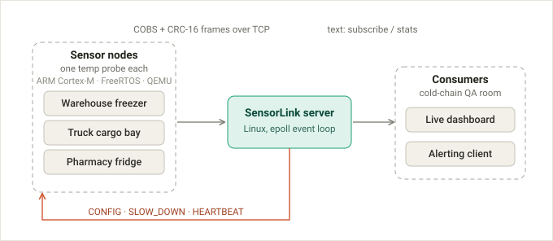

# SensorLink


## Architecture



Picture a pharmaceutical cold chain: a warehouse freezer, a refrigerated
delivery truck, and a pharmacy fridge — three physically separate
refrigeration units that must each stay within a safe temperature range, a
failure in any one of them caught too late by a twice-a-day clipboard check.
SensorLink is an end-to-end telemetry system for exactly this kind of
scenario, written entirely in C++: each unit carries an identical sensor
node — firmware for an **ARM Cortex-M microcontroller** running **FreeRTOS**,
emulated in **QEMU** with no physical hardware — that streams COBS-framed,
CRC-16-checked packets over **TCP** to a central Linux server built on a
single-threaded **epoll event loop**, which fans the data out live to
subscriber programs and can tell a struggling node to slow down. The same
shape fits smart-home sensing, air-quality monitoring, or machine-vibration
monitoring — swap the labels, keep the code.

## Features

- COBS-framed, CRC-16-checked binary protocol shared between firmware and server
- Four fixed-priority FreeRTOS tasks, zero dynamic allocation in the data path
- Single-threaded epoll event loop, non-blocking multi-client TCP server
- Server-driven sample rate, with live SLOW_DOWN backpressure to the devices
- Bidirectional heartbeat between device and server
- Benchmarked up to 1000 simulated devices

## Project structure

```
proto/    shared protocol library — COBS, CRC-16, frame parser/encoder,
          fixed-capacity containers (host- and firmware-tested)
node/     FreeRTOS firmware for the QEMU-emulated Cortex-M target —
          sensor/process/telemetry/command tasks, session handling,
          RAII wrappers over the FreeRTOS API, UART driver
server/   epoll-based multi-client TCP server — event loop, connection
          handling, device sessions, ingest, subscriber protocol,
          in-memory per-device history
client/   CLI that connects to the server and prints a live feed
bench/    load generator, latency subscriber, and a benchmark sweep script
tests/    GoogleTest unit tests, plus a real QEMU-to-server integration test
docs/     the architecture diagram
```

## Prerequisites

Development happens inside **WSL2 Ubuntu** (both `epoll` and the ARM cross
toolchain need Linux).

- C++17 compiler (`g++` or `clang`)
- CMake >= 3.21 and Ninja
- `gcc-arm-none-eabi` and `gdb-multiarch` (cross toolchain for the firmware)
- `qemu-system-arm` (runs the firmware with no physical hardware)
- `clang-tidy`, `cppcheck`, `gcovr` (static analysis and coverage, used in CI)
- Python 3 (only needed for `bench/run_benchmark.py`)

```bash
sudo apt update
sudo apt install -y gcc-arm-none-eabi gdb-multiarch qemu-system-arm \
                    cmake ninja-build g++ clang clang-tidy cppcheck gcovr git
```

GoogleTest is fetched automatically by CMake (`FetchContent`); the
FreeRTOS kernel is a git submodule.

## Setup and run

```bash
git clone --recurse-submodules https://github.com/inbarayasoo/SensorLink.git
cd SensorLink

cmake --preset host && cmake --build build/host
./build/host/server/sensorlink-server --ingest 6000 --subscribe 6001 &

cmake --preset firmware && cmake --build build/firmware
qemu-system-arm -M mps2-an385 -nographic -semihosting \
    -kernel build/firmware/sensorlink-node.elf -serial tcp:127.0.0.1:6000 &

./build/host/client/sensorlink-client --connect 127.0.0.1:6001 --subscribe temp
```

## Benchmark results

`bench/run_benchmark.py` starts a real server plus N simulated devices, each
streaming at the server's own rate cap (10 Hz), plus one live subscriber, and
measures throughput, drop count, ingest-to-feed latency, and server memory.

| N devices | frames/sec | drops | p50 latency | p99 latency | server RSS |
|---|---|---|---|---|---|
| 10 | 101 | 3 | 0 ms | 1 ms | 2.0 MB |
| 50 | 509 | 3 | 0 ms | 1 ms | 2.0 MB |
| 200 | 2039 | 3 | 0 ms | 1 ms | 3.7 MB |
| 1000 | 10200 | 2 | 0 ms | 1 ms | 5.0 MB |

Throughput scales linearly with device count, drops stay negligible, and
latency stays at 0-1 ms even at 1000 concurrent connections.

Firmware footprint: ~8 KB flash, ~6.8 KB RAM for the full node image
(four FreeRTOS tasks, the protocol library, and the UART driver), measured
with `arm-none-eabi-size` on the QEMU MPS2-AN385 (Cortex-M3) target.

## Testing & CI

96 GoogleTest unit tests across `proto/`, `server/`, and `client/`, plus a
real integration test that boots the firmware in QEMU against a real server
and asserts the sample rate actually drops when the server sends
`SLOW_DOWN`. Four jobs run on every push: host build + test + coverage
report, firmware cross-build, the QEMU integration test, and static analysis
(`clang-tidy` + `cppcheck`).

## Design decisions

- **COBS framing, not a simple escape-byte scheme.** COBS guarantees a low,
  fixed worst-case overhead (at most 1 byte per 254) and removes the frame
  delimiter from the payload entirely, so re-sync after garbage on the line
  is always possible.
- **CRC-16, not a plain checksum or CRC-32.** A plain sum/XOR checksum misses
  common burst errors; CRC-16 (CCITT) catches them reliably. Frames here are
  small (tens of bytes), so 16 bits is enough detection strength — CRC-32
  would cost more CPU and bytes on a microcontroller for no real gain at this
  frame size.
- **A single-threaded `epoll` event loop, not thread-per-connection.** A
  thread per socket doesn't scale past a few hundred connections (stack
  memory, context-switch cost) and forces locking around any shared state.
  One event loop over non-blocking sockets scales further and needs no locks
  on the device/subscriber tables.
- **A table-driven parser state machine, not ad-hoc byte parsing.** Each
  incoming byte does a single table lookup and state transition — O(1) per
  byte, no allocation, and a bad byte just drops the parser back to
  scanning for the next delimiter instead of getting stuck.
- **Static allocation only in the firmware** (`configSUPPORT_DYNAMIC_ALLOCATION`
  is off). Heap fragmentation and out-of-memory are unpredictable on a
  memory-constrained device; every task, queue, and buffer instead gets a
  fixed size decided up front.

## License

MIT — see [LICENSE](LICENSE).
